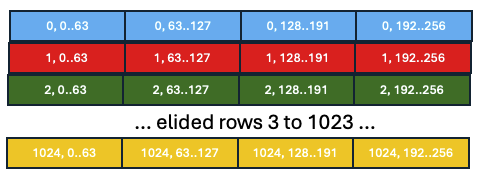
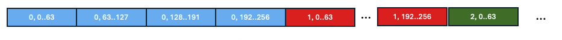
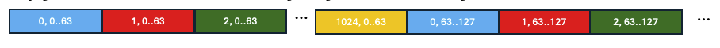

# Problem Statement

## Background: Spyre Tensors

Spyre is a SIMD dataflow engine.  All memory and compute operations
operate on chunks of 128 bytes.  We call this chunk of 128 bytes a
_stick_.  The in-memory format of tensors on the Spyre device is
designed to support efficient SIMD computations on sticks of data. In
particular, one or more of every tensor’s dimensions are designated as
stick dimensions.  All stick dimensions are padded to be multiples of
128 bytes. To maximize reuse and to enable efficient device
memory/scratchpad transfers, stick dimensions are laid out in a tiled
fashion in the device’s memory (sticks that are consecutive in a stick
dimension from the perspective of PyTorch-level indexing may not
actually be assigned consecutive memory addresses on the device).  The
importance of memory layout for efficient computation is familiar from
GPUs, but it is even more important on Spyre.  Furthermore, the
compute operations of Spyre’s SIMD dataflow engine impose a number of
legality constraints on the memory layout of their inputs and the
layout of the resulting output.

 As a simple concrete example of a stickfied tensor, consider a 2-D
 tensor of float16 with a PyTorch size of `(1024, 256)` where dimension
 `1` is designated as the stick dimension.  Each stick contains 64
 2-byte float16 values; therefore the 256 elements of each row of
 dimension 1 form exactly 4 sticks.  The picture below shows a logical
 view of this tensor, highlighting how the rows are divided into
 sticks.



In a standard row-major memory layout, the sticks of the tensor would
be linerarized in memory as shown in the picture below. This is
represented in PyTorch with a stride of `(1024, 1)`.



In contrast, Spyre tiles the sticks of the Tensor so that they are
linearized in device memory as depicted in the picture below:



In effect, the 2-D Tensor of size `(1024, 256)` is laid out in device
memory as if it was a 3-D Tensor of size `(4, 1024, 64)` with a stride
of `(65536, 64, 1)`.

Generalizing to N dimensions with k stick dimensions but deferring
considering padding for the moment, the mapping between host and
memory layouts can be represented as 3 tuples of N+k integers
corresponding to the loop ranges, host strides and device strides of
an N+k loop nest. By convention we order the elements of the three
tuples from outermost to innermost loop.  Using this notation, the
concrete example above would have the specification: `(64, 1024, 4)`,
`(1, 64, 65536)`, `(1, 256, 64)` which corresponds to the loop nest below:

```
for i in range(64):
  for j in range(1024):
    for k in range(4):
      device_memory[device_tensor_address + i*1 + j*64 + k*65536] = host_memory[host_tensor_address + j*256 + (k*64 + i*1) ]
```

Stickifcation of tensors can add padding to the device memory layout in two ways.

If the number of elements in a stick dimension does not divide evenly
into sticks, then the last partial stick is padded to make the
dimension evenly divisible.  Compute operations are masked as needed
so the added elements do not affect their results.  Tensors in host
memory are not padded, so the mapping between device and host memory
layouts described above is extended with modulus/floor operations.

When reduction operations are performed on a stick dimension, Spyre’s
SIMD engine produces results that only contain one element per stick.
Mappings between host and device memory for the resulting stick-sparse
tensors can be encoded just in the strides (no modulus/floor is
needed).

### Implications of Sticks for PyTorch

To implement host/device memory transfers and device memory allocation
for Spyre, the runtime representation of Spyre Tensors must accurately
capture the permutation of elements required to transform the host
memory layout tensors to the device memory layout and vice versa.

For correct compilation and optimization, Inductor needs to
accurately model the stickified memory layout of Spyre tensors.  Some
key challenges include capturing the non-contiguity of stick
dimensions (impacts loop simplifications), the sparse layout of data
after stick-dimension reductions (impacts memory planning and backend
code generation), and the need for the operands to binary pointwise
operations to have compatible memory layout to reflect legality
constraints imposed by the hardware.

The programming model needs to have hooks that enable programmers to
provide hints/directives to fully control the choice and ordering of
stick dimensions for individual Tensors to enable them to guide the
compiler/runtime system into making optimal use of the hardware for
key kernels.

# Proposed Solution

## Runtime / Programming Model Support

The torch-spyre plugin implements `SpyreTensorImpl`, a subclass of
`TensorImpl` that contains a `SpyreDeviceLayout` object with encapsulates
the device memory layout information.  In our current implementation,
`SpyreDeviceLayout` stores the device size and strides,
a mapping between host and device dimensions, and padding/stick dimension
information. The 3 tuples mentioned earlier and needed for DMA operations
can be derived from `SpyreDeviceLayout` and the host size and strides stored
in the `TensorImpl`.

This `SpyreDeviceLayout` is initialized whenever a Tensor is
created on the Spyre device (eg. by using `to` to transfer a Tensor to
the device, by allocating a new empty Tensor on the device, etc).

By default, dimension N-1 is designated as the stick dimension (and is
padded as needed to evenly divide into sticks).  The `to` operation is
extended to optionally take a list of stick dimensions to enable the
programmer to override the default stick dimension.  Similarly, Tensor
allocation operations are extended to allow optional explicit
specification of the stick dimension(s) when Tensors are created on
the device (the default is used if no explicit specification is
given). The runtime uses this data to implement Tensor data transfers
to/from the host and Spyre device.  A custom `restickify` operation is
provided that allows the programmer or compiler to explicitly
transform the on-chip memory layout of a Tensor to change the stick
dimension(s). This is an expensive operation, since it involves
creating a new backing storage on the device and reading/writing all
bytes of the Tensor to achieve the required memory layout.

## Dynamo / Inductor Compile Time Support

For both correctness and optimization purposes, the on-device memory
layout of Spyre Tensors must be accurately represented in at least
some layers of Dynamo and Inductor.

The main ideas of our current implementation approach are:

1. We add a subclass of `FixedLayout` called `SpyreFixedLayout` that
adds a `device_layout` field that contains a SpyreDeviceLayout.

2. When a `FakeTensor` is created for a graph input that is
a `SpyreTensorImpl`, we use its `SpyreDeviceLayout` to construct the
corresponding `SpyreFixedLayout` instead of the default `FixedLayout`.

3. Before final code generation from LoopLevelIR, we ensure that
all realized operations have `SpyreFixedLayouts` instead of `FixedLayout`.

In our current prototype, we have accomplished `3` by interposing
fairly  early in Inductor's compilation stages.  In particular, we
+ dynamically add a new field to `FakeTensor` instances that holds an
  instance of the `SpyreDeviceLayout` class

+ enhance the code that constructs a `FakeTensor` from a `Tensor` to capture
the `SpyreDeviceLayout` and store it in the `FakeTensor`.

+ enhance the `FakeTensor` propagation machinery and fake_ops to use the
extended layout information on their inputs to compute the extended
layout information of their outputs.

+ use the extended layout information from the fx graph nodes in the
Spyre backend code generation.

We are also evaluating a less invasive alternative implementation of
`3` in which device layouts are introduced later in Inductor compilation,
by doing a pass over the SchedulerNodes immediately before final code generation
and replacing `FlexibleLayout` with `SpyreFixedLayout` using the `SpyreFixedLaout` information
from the Node's inputs and the operation being performed to derive the
`SpyreFixedLayout` of the output.
