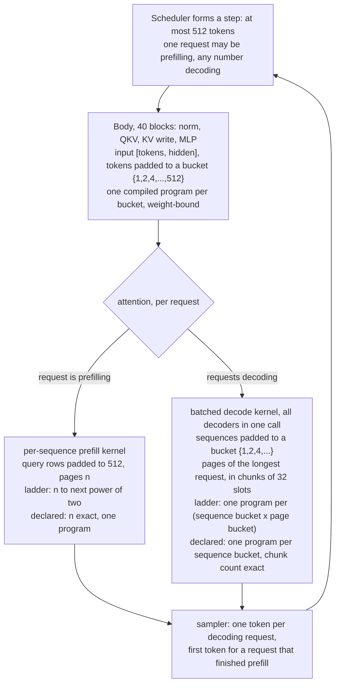

```mermaid
flowchart TD
    S[Scheduler forms a step: at most 512 tokens<br/>one request may be prefilling, any number decoding] --> B
    B["Body, 40 blocks: norm, QKV, KV write, MLP<br/>input [tokens, hidden], tokens padded to a bucket {1,2,4,...,512}<br/>one compiled program per bucket, weight-bound"] --> A
    A{attention, per request}
    A -->|request is prefilling| P["per-sequence prefill kernel<br/>query rows padded to 512, pages n<br/>ladder: n to next power of two<br/>declared: n exact, one program"]
    A -->|requests decoding| D["batched decode kernel, all decoders in one call<br/>sequences padded to a bucket {1,2,4,...}<br/>pages of the longest request, in chunks of 32 slots<br/>ladder: one program per (sequence bucket x page bucket)<br/>declared: one program per sequence bucket, chunk count exact"]
    P --> O
    D --> O
    O["sampler: one token per decoding request,<br/>first token for a request that finished prefill"] --> S
```

```mermaid
gantt
    title Steps on one card, max 512 tokens a step, one partial prefill at a time
    dateFormat X
    axisFormat %s
    section req A 1040 tok, 60 out
    prefill 512 (4 pages)      :a1, 0, 1
    prefill 512 (8 pages)      :a2, 1, 2
    prefill 16 as 512 (9 pages):a3, 2, 3
    decode, 60 steps           :a4, 3, 63
    section req B 300 tok, 20 out
    prefill 300 as 512 (3 pages) :b1, 3, 4
    decode, 20 steps           :b2, 4, 24
    section req C 2000 tok, 128 out
    prefill 512 :c1, 4, 5
    prefill 512 :c2, 5, 6
    prefill 512 :c3, 6, 7
    prefill 464 as 512 (16 pages) :c4, 7, 8
    decode, 128 steps          :c5, 8, 136
    section req D 100 tok, 40 out
    prefill 100 as 512         :d1, 8, 9
    decode, 40 steps           :d2, 9, 49

```
