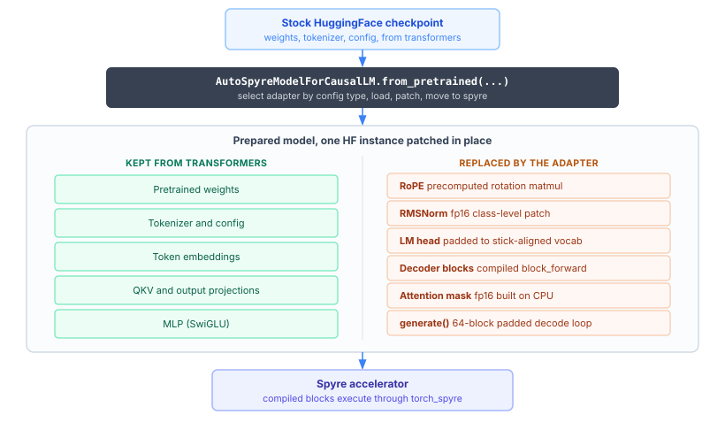

# Running HuggingFace models on Spyre

Most models people want to run on Spyre already exist as stock
[HuggingFace Transformers](https://github.com/huggingface/transformers)
checkpoints. The
[hf-adapters](https://github.com/torch-spyre/hf-adapters) project lets you
run those checkpoints on the Spyre device without forking the model or
writing a custom class. Each adapter monkey-patches the standard HF model at
load time and replaces only the operations Spyre cannot execute natively:
RoPE precomputation, RMSNorm, LM-head padding, KV cache management, and the
generation loop. Weights, tokenizer, and config come straight from
`transformers`.

hf-adapters is a separate Apache-2.0 project in the same
[torch-spyre](https://github.com/torch-spyre) GitHub organization. It depends
on `torch_spyre` for the Spyre device. The `spyre` dependency group resolves
`torch-spyre` from Git at the ref set in the hf-adapters `pyproject.toml`
`[tool.uv.sources]` table, which is currently the `main` branch. Because
`main` is a moving ref, a `uv sync` resolves to whatever `torch-spyre` commit
is at the tip of `main` at that time, and the adapters track the current
`torch-spyre` API rather than any single tagged release. A separate local
Torch-Spyre checkout is not used by default. For a reproducible resolve, set
that entry to an immutable commit SHA; for development against a specific
Torch-Spyre revision, point it at your local checkout with a uv source
override. See [Installation](../getting_started/installation.md) for the
Torch-Spyre install options.



The loader reads the checkpoint's config, picks the adapter for that model
family, and patches one live HF model instance. Everything Spyre executes
natively stays as it is in `transformers`. Only the operations Spyre cannot
run natively are swapped: RoPE becomes a precomputed rotation matmul because
Spyre has no `sin`/`cos`, RMSNorm is patched to compute in the model's device
dtype rather than the float32 upcast stock HF uses, the LM head is padded to a
stick-aligned vocab so work division fits the 256 MB per-core span limit, the
decoder blocks become compiled `block_forward` functions with raw-tensor KV
caches, the attention mask is built on CPU as a `float16` tensor, and
`generate()` is a 64-block padded decode loop. The per-operation rationale is
documented in the project's
[ARCHITECTURE.md](https://github.com/torch-spyre/hf-adapters/blob/main/ARCHITECTURE.md#how-the-adapters-work).

Coverage spans four kinds of model: generative causal-LMs, embedding models
through sentence-transformers, vision-language models that take an image and
produce text, and speculative-decoding drafters. That is Llama, Qwen, Granite,
Mistral, Phi, Gemma, OLMo, and GPT decoders; BERT, XLM-RoBERTa, MPNet, and
ModernBERT encoders; and the Granite Vision, Mistral3 Vision, and Gemma 4
multimodal models. A multimodal checkpoint registers under two entry points:
`AutoSpyreModelForImageTextToText` loads the full VLM and prepares both the
vision tower and the text decoder for Spyre, so it accepts image input;
`AutoSpyreModelForCausalLM` loads only the text backbone and discards the
vision tower, for text-only inference on the same checkpoint. The canonical
per-adapter list of verified checkpoints is in the project's
[ARCHITECTURE.md](https://github.com/torch-spyre/hf-adapters/blob/main/ARCHITECTURE.md#verified-checkpoints).

## Install

hf-adapters uses [uv](https://docs.astral.sh/uv/) for dependency management.
Clone it alongside your Torch-Spyre checkout. On a host with Spyre hardware,
sync the `spyre` group, which pulls in `torch_spyre`, together with the `test`
group, which provides `pytest`:

```bash
git clone https://github.com/torch-spyre/hf-adapters.git
cd hf-adapters
uv sync --group spyre --group test
```

`uv sync` is exact by default and prunes anything outside the groups you name,
so both groups must be listed in a single command. The CPU accuracy tests,
which compare an adapter against stock HF, need no accelerator. To set up a
CPU-only host for those tests, sync just the `test` group:

```bash
uv sync --group test
```

## Generative models

Load a causal-LM with `AutoSpyreModelForCausalLM`. It reads the checkpoint's
config, selects the matching adapter, prepares the model for Spyre, and moves
it to the device. The tokenizer is the stock HF one.

```python
from hf_adapters import AutoSpyreModelForCausalLM
from transformers import AutoTokenizer

model = AutoSpyreModelForCausalLM.from_pretrained(
    "ibm-granite/granite-3.3-8b-instruct"
)
tokenizer = AutoTokenizer.from_pretrained("ibm-granite/granite-3.3-8b-instruct")

outputs = model.generate(tokenizer, ["What is 2+2?"], max_new_tokens=128)
print(outputs[0])
```

The `generate` method attached to the model is not the stock HF one. It runs a
64-block padded decode loop and takes the tokenizer and a list of prompts
rather than pre-tokenized `input_ids`. Its signature is
`generate(tokenizer, prompts, max_new_tokens, do_sample=None,
temperature=None, top_k=None, top_p=None, eos_token_id=..., timing=False)`.
`max_new_tokens` is required. The sampling parameters default to `None` and
resolve from the model's `generation_config` at call time, so the effective
default follows `explicit kwarg > generation_config > HF global default`. See
[docs/generate_vs_stock_hf.md](https://github.com/torch-spyre/hf-adapters/blob/main/docs/generate_vs_stock_hf.md)
in the project for the full contract and how it differs from
`transformers.generate`.

## Embedding models

For embedding models, use `sentence-transformers` with `backend="spyre"`.
Importing `hf_adapters.st_backend` registers the backend, after which
`SentenceTransformer` applies the right Spyre adapter when it loads the model.

```python
import hf_adapters.st_backend  # registers the Spyre backend
from sentence_transformers import SentenceTransformer

model = SentenceTransformer("Qwen/Qwen3-Embedding-0.6B", backend="spyre")
embeddings = model.encode(["hello world", "how are you"])
```

The standard `SentenceTransformer` methods, `encode()`, `similarity()`, and
the rest, work unchanged.

## Vision-language models

For image-text-to-text models, use `AutoSpyreModelForImageTextToText`. It
loads the full VLM through `AutoModelForImageTextToText`, prepares both the
vision tower and the text decoder for Spyre, and attaches a multimodal
`generate`. Pair it with the checkpoint's `AutoProcessor`, which tokenizes the
prompt and produces the image tensors.

```python
from hf_adapters import AutoSpyreModelForImageTextToText
from transformers import AutoProcessor
from PIL import Image

model = AutoSpyreModelForImageTextToText.from_pretrained(
    "ibm-granite/granite-vision-4.1-4b"
)
processor = AutoProcessor.from_pretrained("ibm-granite/granite-vision-4.1-4b")
processor.tokenizer.padding_side = "left"  # matches the decode loop

# Build the batch through the chat template, which tokenizes the prompt and
# expands the image tokens in one call. The two-step text/images path
# mis-tiles anyres images, so the single-call path is used instead.
image = Image.open("cat.jpg").convert("RGB")
conversation = [
    {
        "role": "user",
        "content": [
            {"type": "image", "image": image},
            {"type": "text", "text": "Briefly describe this image."},
        ],
    }
]
batch = processor.apply_chat_template(
    conversation,
    add_generation_prompt=True,
    tokenize=True,
    return_dict=True,
    return_tensors="pt",
)

texts = model.generate(
    processor,
    batch["input_ids"],
    batch["attention_mask"],
    batch["pixel_values"],
    batch["image_sizes"],
    max_new_tokens=64,
)
print(texts[0])
```

The multimodal `generate` takes the processor, the tokenized `input_ids` and
`attention_mask`, and the image tensors, then runs the same padded decode loop
as the text path. The extra image inputs vary by model: Granite Vision and
Mistral3 Vision take `image_sizes` for anyres tiling, and Gemma 4 takes
`image_position_ids` and `mm_token_type_ids`. Pass whatever the processor
produced. To run only the text backbone of a multimodal checkpoint, load it
with `AutoSpyreModelForCausalLM` instead, which discards the vision tower.

## A note on numerical accuracy

Greedy decoding on Spyre can diverge from the same checkpoint run with stock
HuggingFace on CPU. Even single-token decode can produce a greedy-token
mismatch: prefill and the first decode token often match, but they are not
guaranteed to, and once one token differs the rest of the sequence can drift
and become incoherent. The cause is not a single missing feature. Spyre uses
dtype conversions that differ slightly from CPU, and greedy decoding is
sensitive to small numerical differences: a tiny gap in the logits flips the
argmax, and the error compounds token by token. Because the `torch_spyre`
stack changes often, both the severity and the set of affected models shift
over time, so it is worth comparing output against the same checkpoint on CPU
before you rely on it.

The hf-adapters test suite accounts for this. The causal-LM accuracy tests
assert the same top-1 token at each step against stock HF, and the embedding
tests assert a per-token cosine floor rather than exact equality. For which
checkpoints have been verified and in which mode, use the per-adapter list in
[ARCHITECTURE.md](https://github.com/torch-spyre/hf-adapters/blob/main/ARCHITECTURE.md#verified-checkpoints),
which is kept current as the stack moves.

## Learn more about the approach

The hf-adapters project documents its design in detail:

- [ARCHITECTURE.md](https://github.com/torch-spyre/hf-adapters/blob/main/ARCHITECTURE.md)
  covers how the adapters work, the per-operation deviations from stock
  HuggingFace, per-model adaptations, and the verified checkpoint list.
- [generate_vs_stock_hf.md](https://github.com/torch-spyre/hf-adapters/blob/main/docs/generate_vs_stock_hf.md)
  explains how the Spyre `generate()` differs from `transformers.generate`.

## See Also

- [Running Models](running_models.md) for compiling your own models with
  `torch.compile`
- [Supported Operations](supported_operations.md)
- [hf-adapters on GitHub](https://github.com/torch-spyre/hf-adapters)
