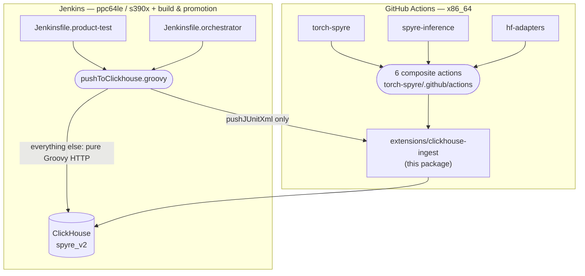

# spyre-clickhouse-ingest — full reference

The identity, schema and write-path library shared by every Spyre CI ingest
— and the two other systems that push the same warehouse: the reusable
GitHub Actions three product repos call, and the Jenkins shared library that
covers the architectures GHA doesn't.

For the library's own rationale and install-from-checkout instructions, see
the top-level [`../README.md`](../README.md). This directory goes further:
it documents every class, every consumer across all three product repos, the
GitHub Actions side, and — new here — the **Jenkins** side, which writes
`test_cases`/`test_case_runs` for ppc64le/s390x and `artifacts`/
`artifact_tags`/`artifact_results` for build/promotion tracking, through an
entirely separate mechanism worth understanding on its own terms.

## Contents

1. **[Classes](classes.md)** — every class in `identity.py`, `schema.py`,
   `client.py`, `writer.py`, `junit.py`, the hardware-diagnostics trio, and
   `apply_schema.py`, with concrete real-world use cases drawn from the
   actual consumers below — not hypothetical examples.
2. **[GitHub Actions](github-actions.md)** — the six reusable composite
   actions in `torch-spyre/.github/actions/`, and how **torch-spyre**,
   **spyre-inference**, and **hf-adapters** each call them to push test
   results, benchmarks, and capabilities; hardware diagnostics for
   torch-spyre and spyre-inference (hf-adapters does not have this yet —
   stated plainly, not glossed over).
3. **[Jenkins shared library](jenkins-shared-library.md)** — `spyre-frameworks`'
   `pushToClickhouse.groovy` and the Jenkinsfiles that call it: how Power
   (ppc64le) and s390x test results reach `test_cases`/`test_case_runs`, and
   how `artifacts`/`artifact_tags`/`artifact_results` get written from the
   build/promotion side. Includes the identity-derivation hazard that spans
   both this page and the GHA side.
4. **[Getting started](getting-started.md)** — install from source, reuse
   from a new GitHub Actions workflow, reuse from a new Jenkins pipeline,
   and how to run the test suite.

## The shape of the whole system

Two systems, one warehouse, and — as documented on the
[Jenkins page](jenkins-shared-library.md#identity-one-formula-four-implementations)
— **not** one identity implementation. That's the single fact most worth
carrying out of this whole reference.

## Quick links by task

| I want to... | Go to |
|---|---|
| Understand what a specific class/method does | [Classes](classes.md) |
| Add ClickHouse ingest to a new GitHub Actions workflow | [Getting started § GHA](getting-started.md#reuse-it-as-a-github-actions-workflow) |
| Add ClickHouse ingest to a new Jenkins pipeline | [Getting started § Jenkins](getting-started.md#reuse-it-as-a-jenkins-shared-library) |
| See which repo writes which table | [GitHub Actions § Who calls what](github-actions.md#who-calls-what), [Jenkins § artifacts tables](jenkins-shared-library.md#artifacts--artifact_tags--artifact_results) |
| Understand why Power/s390x results differ from x86_64's path | [Jenkins § Test results on power and s390x](jenkins-shared-library.md#test-results-on-power-and-s390x) |
| Change an identity-derivation function safely | [Jenkins § Identity: one formula, four implementations](jenkins-shared-library.md#identity-one-formula-four-implementations) |
| Install and run the tests locally | [Getting started § Install](getting-started.md#install-from-source) |
