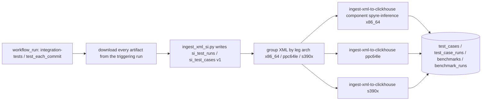
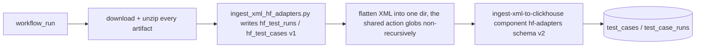
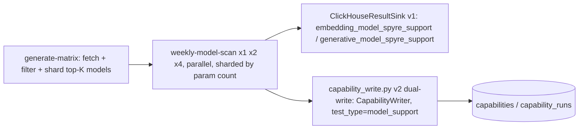

# GitHub Actions: reusable workflows and composite actions

[← Back to index](README.md)

`extensions/clickhouse-ingest` never runs on its own. Three product repos —
**torch-spyre**, **spyre-inference**, and **hf-adapters** — install it in CI
and drive it from GitHub Actions. Rather than each repo carrying its own
checkout+venv+install+parse+ingest sequence, the actual implementation lives
once, as **six composite actions in `torch-spyre/.github/actions/`**, callable
from any repo as:

```yaml
uses: torch-spyre/torch-spyre/.github/actions/<name>@main
```

Because a composite action cannot receive secrets implicitly, every one of
them takes the ClickHouse connection as **plain inputs**, and every one gates
itself to a clean no-op when `clickhouse-host` is empty — a caller with no
ClickHouse secrets configured (or a fork, or a dev sandbox) simply skips the
ingest rather than failing the run.

- [The six composite actions](#the-six-composite-actions)
- [Who calls what](#who-calls-what)
- [torch-spyre's own workflows](#torch-spyres-own-workflows)
- [spyre-inference's own workflows](#spyre-inferences-own-workflows)
- [hf-adapters' own workflows](#hf-adapters-own-workflows)
- [What does not exist yet](#what-does-not-exist-yet)

---

## The six composite actions

### `setup-clickhouse-ingest` — foundation

The one place that locates — or sparse-checks-out — the library plus a
caller's own scripts, and installs them into a job-local venv. Every action
below calls this one first.

Search order: `$GITHUB_WORKSPACE`, then `torch-spyre-dir`, then a
sparse-checkout of `script-repo` (default `torch-spyre/torch-spyre`) —
never a prebaked image tree, which would silently pin the scripts to
whatever commit built that image.

| Input | Purpose |
|---|---|
| `extra-scripts` | Newline-separated `.github/scripts/*.py` paths the caller needs, beyond the library itself. |
| `extra-deps` | Extra pip packages beyond `clickhouse-connect` + `regex`. |
| `script-repo` / `script-ref` | Sparse-checkout fallback source. Consumers outside torch-spyre must keep the default `script-repo`, or the fallback checks out the calling repo and finds nothing. |
| `torch-spyre-dir` | Fallback directory holding a torch-spyre checkout, searched before a sparse-checkout. |

Output: `root` — the directory holding both trees for this call.

### `ingest-xml-to-clickhouse`

JUnit + benchmark XML to ClickHouse, via `ingest_xml.py`. The only ingest
implementation for the schema-v2 functional/benchmark tables; every repo's
XML pipeline ends here.

| Key input | Purpose |
|---|---|
| `xml-dir` | Directory to glob for `*.xml`, non-recursive. Empty skips the whole action. |
| `run-id` / `gha-run-id` | Threaded orchestrator uuid (joins `artifact_results`) vs. the numeric GHA dedup key. |
| `artifact-id` | From `derive-gha-artifact-id`. Set, it also writes the `artifacts` row + verdict; empty writes neither. |
| `component` / `platform` / `trigger-type` | Hash inputs and tier label stamped on v2 rows — `component` is the value that keeps hf-adapters' and torch-spyre's `test_cases` from colliding on an identically-named test. |
| `schema` | `v1` (default) / `v2` / `both` — the migration-window switch. |
| `clickhouse-*` | Connection; empty `clickhouse-host` is a clean no-op. |

### `ingest-hw-diagnostics-to-clickhouse`

Downloads every job log from a GHA run, parses it for hardware failures
(`parse_hw_failures.py`), and inserts the records (`ingest_hw_diagnostics.py`)
— the pipeline that backs the "Spyre Hardware Health" Grafana dashboard.
Without it, a card-level RAS fault surfaces only as a pytest failure and never
reaches the hardware-health view.

| Key input | Purpose |
|---|---|
| `gha-run-id` (required) | Run whose job logs are analysed. |
| `arch` | Arch of the analysed legs — never `$(uname -m)` of the ingest runner itself. A wrong value derives a `run_id` that joins nothing, silently. |
| `clickhouse-db-v2` / `schema` | `hw_failure_diagnostics` has the same shape in both generations, so v2 reinserts the same rows qualified with this database instead of diverging into a new table model. |

Output: `json-file` — the parsed JSON, for the caller to upload as its own
artifact.

Currently called by torch-spyre and spyre-inference only — see
[What does not exist yet](#what-does-not-exist-yet).

### `ingest-model-ops-to-clickhouse`

Downloads model-ops job logs, parses them for operation-support variants
(`parse_model_ops_logs.py`), and inserts them (`ingest_model_ops.py`) as
`capabilities`/`capability_runs` rows with `test_type="model_ops"`. Filters
strictly on the job-name prefix `model-ops /`, not a `Spyre` substring match
— a regression-matrix job also carries that word and would otherwise land as
a fake model-ops suite.

| Key input | Purpose |
|---|---|
| `gha-run-id` (required) | Nightly run to analyse. |
| `schema` | `v1` / `v2` / `both`. |

Outputs: `json-file`, `log-file`, `has-variant-data` — the ingest step is
skipped whenever parsing found zero variants, so an in-progress or
log-unavailable run never overwrites good stored suites with empty ones.

### `ingest-pytorch-dispatch-to-clickhouse`

Classifies a `repository_dispatch` payload from pytorch/pytorch's CI relay
(CRCR) and records it via `ingest_pytorch_dispatch.py` — one implementation,
so another repo tracking the same relay calls it directly rather than
reimplementing the classification.

| Key input | Purpose |
|---|---|
| `payload-json` (required) | The dispatch's `client_payload`, as JSON text. |
| `stage` / `progress` | Pipeline point (`torch_build`, `running_tests`, ...) and lifecycle state (`in_progress` / `completed` / `rejected`). |

### `derive-gha-artifact-id`

Derives the warehouse `artifact_id` for what a GHA leg actually ran, and
uploads it so a later `workflow_run` ingest can stamp it on the rows. Must run
on the image under test — the base id lives in that image's own filesystem.
Empty output is a normal outcome, never a failure: an image baked before the
base-id label existed carries none.

| Key input | Purpose |
|---|---|
| `installed` | What this leg installed on top of the image, space/comma-separated. Empty = image ran unchanged, base id used verbatim. |
| `output-file` | Uploaded as a one-line record, not a bare uuid (uuid5 can't be read back): `<artifact_id>|<base_artifact_id>|<installed,comma,joined>`. |

Outputs: `artifact_id`, `base_artifact_id`.

---

## Who calls what

```mermaid
flowchart TB
  subgraph TS["torch-spyre"]
    TS1["push-to-clickhouse.yaml"]
    TS2["push-hw-diagnostics-to-clickhouse.yaml"]
    TS3["push-model-ops-logs-to-clickhouse.yaml"]
    TS4["push-pytorch-dispatch-to-clickhouse.yaml"]
  end
  subgraph SI["spyre-inference"]
    SI1["push-to-clickhouse.yaml"]
    SI2["push-hw-diagnostics-to-clickhouse.yaml"]
    SI3["_test_matrix.yaml perf leg, inline"]
  end
  subgraph HF["hf-adapters"]
    HF1["push-test-results-to-clickhouse.yaml"]
    HF2["push-to-clickhouse.yaml weekly HF-Hub scan"]
  end

  A(["ingest-xml-to-clickhouse"])
  B(["ingest-hw-diagnostics-to-clickhouse"])
  C(["ingest-model-ops-to-clickhouse"])
  D(["ingest-pytorch-dispatch-to-clickhouse"])

  TS1 --> A
  TS2 --> B
  TS3 --> C
  TS4 --> D
  SI1 --> A
  SI2 --> B
  SI3 --> A
  HF1 --> A
  HF2 -.own capability_write.py, same writer.py classes.-> C
```

hf-adapters' weekly scan doesn't call the `ingest-model-ops-to-clickhouse`
action (it isn't log-driven), but it dual-writes through the exact same
`CapabilityWriter` classes the action's script uses underneath — see
[capability_write.py in the class reference](classes.md#writerpy).

---

## torch-spyre's own workflows

| Workflow | Triggers | Calls |
|---|---|---|
| `push-to-clickhouse.yaml` | `workflow_run` of `model-module-tests`, `upstream-pytorch-tests`, `model-ops-tests`, `tests`, `integration-tests`; manual dispatch | `ingest-xml-to-clickhouse` (v1 direct write + v2 via the action, once per populated arch: x86_64/ppc64le/s390x) |
| `push-hw-diagnostics-to-clickhouse.yaml` | same `workflow_run` set | `ingest-hw-diagnostics-to-clickhouse` |
| `push-model-ops-logs-to-clickhouse.yaml` | model-ops nightly run completion | `ingest-model-ops-to-clickhouse` |
| `push-pytorch-dispatch-to-clickhouse.yaml` | `repository_dispatch` from pytorch/pytorch's CRCR relay | `ingest-pytorch-dispatch-to-clickhouse` |

`derive-gha-artifact-id` runs earlier, inside the test-execution workflow
itself (on the image under test), not inside any `push-*` workflow — its
output is what a later `push-to-clickhouse.yaml` run picks up as
`--artifact-id`.

---

## spyre-inference's own workflows

### `push-to-clickhouse.yaml`

Ingests JUnit XML from spyre-inference's own pytest matrix. Triggered by
`workflow_run` of `integration-tests` or `test_each_commit` (both call the
same reusable `_test_matrix.yaml`, so they emit the same suite shape), plus
manual dispatch to re-ingest a specific run.



Notable: XML artifacts are downloaded paginated (`gh api --paginate`) — the
artifacts endpoint defaults to 30/page, and an unpaginated call against a run
with more jobs than that silently lost XML with no error.

### `push-hw-diagnostics-to-clickhouse.yaml`

A single-step job: calls `ingest-hw-diagnostics-to-clickhouse` with
`schema: both` (dual-write during the v1-to-v2 migration window) and a
hardcoded `arch: x86_64` — literal, not `$(uname -m)`, because the HW test
matrix this workflow follows only runs on the x86 Spyre pool today.

---

## hf-adapters' own workflows

hf-adapters has two clickhouse-facing workflows with a naming trap worth
calling out explicitly: `push-to-clickhouse.yaml` here is not the XML ingest
— that name was already taken by an unrelated weekly cron job before the XML
ingest existed, so the XML ingest lives in `push-test-results-to-clickhouse.yaml`
instead.

### `push-test-results-to-clickhouse.yaml`

Two independent jobs, both triggered by `workflow_run` of `integration-tests`
or `test_pull_request`:

`ingest` — JUnit XML from hf-adapters' model-centric e2e suites (smoke, load,
token_compare, embed_compare, vlm, model_module):



`ingest-module-logs` — raw GHA job logs from the `Spyre model-module tests`
job family, writing `module_test_suites` / `module_test_variants`. This path
is independent of `spyre_clickhouse_ingest` entirely: `ingest_module_tests.py`
declares its own inline DDL and derives row identity from
`SHA256(gha_run_id || suite_name)`, not `identity.py`'s `uuid5` scheme. Treat
it as a related but separately-maintained v1 write path, not a consumer of
this library's identity functions.

### `push-to-clickhouse.yaml` — the weekly HF-Hub model-support scan

Not a post-hoc XML ingest at all: this workflow *is* the test — it fetches
the top-K HuggingFace Hub models, evaluates each on CPU/GPU/Spyre, and writes
its own verdict directly.



The v2 half (`capability_write.py`) is a direct consumer of this library's
`CapabilityWriter` — see [its writer.py entry](classes.md#writerpy) for the
identity/sharding details. It installs the library as a per-job step
(`CH_INGEST_LIB`), never as a `pyproject.toml` dependency, for the same
reason spyre-inference does: `build-hf-adapters` runs `uv sync --frozen`,
which would otherwise pin the library to a locked commit.

---

## What does not exist yet

Documenting this repo's own request accurately means saying plainly where the
pattern is not implemented, rather than describing a symmetry that doesn't
exist on disk:

- hf-adapters has no hardware-diagnostics ingest. There is no
  `push-hw-diagnostics-to-clickhouse.yaml`, no call to
  `ingest-hw-diagnostics-to-clickhouse`, and no `hw_failure_diagnostics` write
  path anywhere in the repo as of this writing. Only torch-spyre and
  spyre-inference currently populate that table. Adding it to hf-adapters
  would mean a new workflow calling `ingest-hw-diagnostics-to-clickhouse`
  with `component: hf-adapters`, following the exact shape of
  spyre-inference's `push-hw-diagnostics-to-clickhouse.yaml` above.
- `ingest_module_tests.py` (hf-adapters) is not a `spyre_clickhouse_ingest`
  consumer, despite living beside one — see the module-logs job above.

[← Back to index](README.md) · [← Classes](classes.md) · [Next: Jenkins shared library →](jenkins-shared-library.md)
