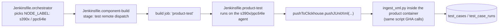

# Jenkins shared library: the other side of the write path

[← Back to index](README.md)

GitHub Actions only covers **x86_64**. Every **ppc64le** and **s390x** test
leg is dispatched through Jenkins instead, and Jenkins writes ClickHouse
through a completely different mechanism: `spyre-frameworks`' Jenkins shared
library, not this Python package. This page documents that mechanism —
`vars/pushToClickhouse.groovy` — and, importantly, **where it does and does
not share code with `extensions/clickhouse-ingest`**, because that boundary
is a real, actively-managed hazard in this codebase, not an implementation
detail.

> **Read this before assuming "shared library" means "shared code."** Jenkins
> and GHA do **not** call the same Python functions to derive an id. They run
> four independently-maintained implementations of the identical uuid5
> formula, kept in sync by convention and a golden-value test, not by import.
> See [Identity: one formula, four implementations](#identity-one-formula-four-implementations).

- [Where the pieces live](#where-the-pieces-live)
- [`pushToClickhouse.groovy`: the thirteen writer functions](#pushtoclickhousegroovy-the-thirteen-writer-functions)
- [Test results on power and s390x](#test-results-on-power-and-s390x)
- [artifacts / artifact_tags / artifact_results](#artifacts--artifact_tags--artifact_results)
- [Identity: one formula, four implementations](#identity-one-formula-four-implementations)
- [Credentials](#credentials)
- [Fail-soft contract](#fail-soft-contract)
- [Reusing it from a new pipeline](#reusing-it-from-a-new-pipeline)

---

## Where the pieces live

All in `spyre-frameworks`:

| Path | What it is |
|---|---|
| `vars/pushToClickhouse.groovy` | The Jenkins shared-library step. ~2,000 lines, ~13 writer functions. **The actual reusable entry point.** |
| `vars/promoteImages.groovy` | Registry/manifest mutation (crane/skopeo retagging) for image promotion. Never touches ClickHouse. |
| `vars/promotionFanout.groovy` | Triggers downstream Jenkins jobs on promotion. Never touches ClickHouse. |
| `pipelines/clickhouse/*.sql` | The **canonical DDL** — `artifacts_v2.sql`, `functional_tests_v2.sql`, `ci_events_v2.sql`, `views_v2.sql`. This repo's `schema/*.sql` mirrors it (see [schema/README.md](../schema/README.md)); this is the source of truth. |
| `pipelines/lib/run_identity.py`, `artifact_identity.py` | Independent Python reimplementations of the id-derivation formulas, used by the orchestrator and as CLI helpers — **not imported by Groovy**, and **not the same code** as this package's `identity.py`. |
| `pipelines/lib/test_v2_row_contract.py`, `pipelines/lib/test_run_identity.py` | Guard tests that parse the actual Groovy source and check it against the DDL / golden id values, because there is no shared-import mechanism to do this automatically. |
| `pipelines/build/Jenkinsfile.orchestrator` | Writes `artifacts` / `artifact_tags` / `artifact_results` (build & promotion side). |
| `pipelines/build/Jenkinsfile.product-test` | Writes `test_cases` / `test_case_runs` (test-result side) — this is what runs on ppc64le/s390x agents. |
| `pipelines/build/Jenkinsfile.component-build`, `Jenkinsfile.scheduled-orchestrator` | Dispatch chain that gets a test leg onto a Power/Z agent in the first place. |

---

## `pushToClickhouse.groovy`: the thirteen writer functions

It is **not one thing** — it's a set of independent, best-effort writer
functions. Two mechanisms are in play, split cleanly by function:

### Shells out to Python (one function)

**`pushJUnitXml(Map a)`** is the only writer that invokes Python. Inside a
`podman run` against the product's own container image, it runs:

```bash
CHLIB=/home/senuser/torch-spyre/extensions/clickhouse-ingest
LIB_ARG=""; if [ -d "$CHLIB" ]; then LIB_ARG="--with $CHLIB"; fi
UV="uv run --no-project --with lxml --with clickhouse-connect --with regex $LIB_ARG"
$UV <ingestScriptPath> ...
```

where `ingestScriptPath = "/home/senuser/${a.product}/${a.ingestScript ?:
'.github/scripts/ingest_xml.py'}"`. In other words: **the same
`ingest_xml.py` CLI the GHA composite actions call, run inside the product's
own container image**, with `extensions/clickhouse-ingest` attached via
`uv run --with <local-path>` (a local editable install) rather than the
`git+https://...#subdirectory=...` form the GHA actions use — because the
product's own `-dev` image already bakes a checkout of itself (and this
library) at `/home/senuser/<product>/`, so no separate checkout is needed on
the Jenkins side. Writes `test_runs`/`test_cases`/`run_properties` (v1) and,
when v2 is configured, `test_case_runs`/`test_cases` (v2) — the exact same
tables and identity functions GHA writes to, because it's the exact same
script.

### Pure Groovy, direct HTTP (the rest)

Every other writer speaks ClickHouse's native HTTP interface directly —
`curl ... '?query=INSERT ... FORMAT JSONEachRow'` — with **no Python
involved at all**:

| Function | Writes | Notes |
|---|---|---|
| `pushCheckEvent(Map r)` | `pr_check_events` | One row per GitHub check-run transition. |
| `pushArtifactRecord(Map r)` | `artifacts` (v1 + v2), `artifact_refs` (v2) | `INSERT...SELECT` form to preserve `first_seen` on a re-write. |
| `pushArtifactReuse(...)` | appends to `artifacts.jobs_reusing` | When a build is skipped because content is already published. |
| `pushArtifactTag(Map r)` | `artifact_tags` | |
| `pushPromotionEvent(Map r)` | `artifact_tags` | Thin wrapper over `pushArtifactTag` (`tagFamily: 'main'` or a channel name). |
| `pushArtifactResult(Map r)` | `artifact_results` (v1 + v2) | One row per test/perf leg's verdict against an `artifact_id` — the reuse-gate index, distinct from per-case detail. |
| `pushArtifactSources(...)`, `pushArtifactMetadata(...)` | `artifact_sources`, artifact metadata columns | |
| `pushAgentSamples(...)`, `pushPipelineRun(...)`, `pushPipelineRunLegs(...)` | agent/pipeline telemetry tables | |
| `lastVerdicts(...)` | *(reader, not writer)* | |

**`promoteImages.groovy`** does the actual registry work (retagging,
multi-arch manifest joins) and never writes ClickHouse; **`promotionFanout.groovy`**
only triggers downstream Jenkins jobs. The orchestrator's promotion stage
calls both of those *and* `pushToClickhouse.pushArtifactTag`/`pushPromotionEvent`
side by side — registry mutation and ClickHouse bookkeeping are two separate
concerns invoked from the same stage, not one operation.

---

## Test results on power and s390x

Confirmed directly in `pipelines/components/torch-spyre/config.yaml`:

> Power/Z run the shared downstream `jenkins_job`; x86 dispatches the
> product's own GHA integration workflow instead.

Each arch-specific mode entry names the dispatch target explicitly, e.g.:

```yaml
s390x:   { config: { jenkins_job: { params: { PRODUCT: torch-spyre, SUITE: unit, NODE_LABEL: s390x   } } } }
ppc64le: { config: { jenkins_job: { params: { PRODUCT: torch-spyre, SUITE: unit, NODE_LABEL: ppc64le } } } }
```

### Dispatch chain



`Jenkinsfile.product-test` calls `pushJUnitXml` with, among other fields:

```groovy
pushToClickhouse.pushJUnitXml([
    product: params.PRODUCT, ingestScript: env.INGEST_SCRIPT,
    imageRef: "${env.EFF_IMAGE_REF}", xmlDir: xmlDir,
    workflow: "jenkins-${params.PRODUCT}-${params.SUITE}-${params.NODE_LABEL}",
    platform: params.NODE_LABEL,   // 's390x' or 'ppc64le'
    triggerType: params.SUITE, branch: params.GIT_REF, sha: params.GIT_SHA,
    runId: (params.RUN_ID?.trim() ?: "${env.BUILD_NUMBER}"),
    prNumber: params.PR_NUMBER, credentialsId: env.EFF_CH_CREDS,
])
```

`NODE_LABEL`/`platform` is the **only** arch-specific field — it becomes
`benchmark_runs.platform` / `ingest_xml.py`'s `--platform` flag. A comment at
the call site notes that a missing value here made Power rows invisible to
the results tab entirely: `platform` isn't cosmetic, it's what a dashboard
filters on.

There is **no separate Python path** in `pipelines/lib/` for JUnit ingestion
— `pipelines/lib/*.py` never touches XML at all. Power and s390x go through
literally the same `ingest_xml.py` CLI, and therefore the same
`TestResultWriter`/`identity.py` code, as x86_64 GHA legs.

### How `jenkins_run_key` (`"folder/job#123"`) gets built

Two distinct places construct this string, both feeding
[`RunCoordinates.source_and_external`](classes.md#junitpy)'s `"jenkins"`
branch:

1. **Inside `pushJUnitXml` itself** — `env.JOB_NAME` + `env.BUILD_NUMBER`:

   ```groovy
   def _jenkinsRunKey = (env.JOB_NAME && env.BUILD_NUMBER)
       ? "${env.JOB_NAME}#${env.BUILD_NUMBER}".toString() : ''
   ```

   forwarded as `--jenkins-run-key` (only if the baked script's `--help`
   advertises the flag, for back-compat with older images).
2. **In `Jenkinsfile.orchestrator`**, when it records a *dispatched* leg's
   coordinate for `pushArtifactResult`, it uses Jenkins core's own
   `Run.getExternalizableId()` — which already returns the `"folder/job#123"`
   shape — rather than building the string itself, threaded in as
   `testJobKey`.

---

## artifacts / artifact_tags / artifact_results

These are written **only from `Jenkinsfile.orchestrator`**, not from
`product-test`/`component-build` — they cover build-artifact/image tracking
and test-verdict indexing, not per-case JUnit detail:

| Function | Table | When |
|---|---|---|
| `pushArtifactRecord` | `artifacts` (+ v2 `artifact_refs`) | Right after an image/rpm/wheel is built, or a plan node resolved. |
| `pushArtifactReuse` | `artifacts.jobs_reusing` | When a build is skipped because matching content is already published. |
| `pushArtifactTag` | `artifact_tags` | On tagging/promotion. |
| `pushArtifactResult` | `artifact_results` | One row per test/perf leg's verdict against an `artifact_id` — the join target for "what's covered." |

`pipelines/lib/artifact_identity.py` is **not a writer** — it computes/reads
build-reuse content identity (registry labels / Artifactory properties:
"does this artifact already exist"), a different concept from the ClickHouse
row-identity uuid5s, though it hosts its own `v2_artifact_id()` used as a CLI
helper to stamp an image label, not to write ClickHouse rows.

No `capabilities`/`capability_runs` table exists in
`pipelines/clickhouse/*.sql` — that table pair is torch-spyre/GHA-side only
(see [classes.md](classes.md#schemapy)); Jenkins does not currently write
capability rows.

---

## Identity: one formula, four implementations

This is the single most important thing to understand before touching either
side of this pipeline. `pipelines/lib/run_identity.py`'s own docstring states
it plainly:

> Four writers (this orchestrator, and the `ingest_xml*.py` in torch-spyre,
> hf-adapters and spyre-inference) each independently compute `run_id` and
> `test_case_id`. Nothing threads them... **byte-exactness is the contract.**

And `pipelines/lib/test_v2_row_contract.py`:

> The writer is Groovy running in Jenkins; the readers are Python (the
> product ingests, via the shared spyre-clickhouse-ingest library) and the
> dashboard. **Groovy cannot import the library**, so nothing tied the two
> together: the writer's row shape and the model of it agreed only by an
> author reading both files.

The four independently-maintained copies of the uuid5 formula:

1. **`extensions/clickhouse-ingest/identity.py`** (this package) — used by
   every `ingest_xml*.py` in torch-spyre, hf-adapters and spyre-inference, on
   the GHA/x86_64 side.
2. **`spyre-frameworks/pipelines/lib/run_identity.py`** — Python, "the
   canonical reference implementation" per its own docstring, used by the
   orchestrator via `subprocess` and as a standalone CLI helper.
3. **`pushToClickhouse.groovy`'s `deriveRunIds()`** (Groovy) — does **not**
   call `run_identity.py`. Its own comment explains why: uuid5 is SHA-1 over
   namespace bytes, and `java.security.MessageDigest` is sandbox-blocked
   inside a Jenkins pipeline script, and this writer is also called from
   orchestrator stages with no CI checkout on the agent. So it **inlines** a
   bare `python3 -c '...'` one-liner reproducing the identical formula
   byte-for-byte — a fifth surface, really, since it's neither the Groovy
   runtime nor an import of either Python module.
4. **`pipelines/lib/artifact_identity.py`'s `v2_artifact_id()`** — its own
   docstring: *"A FOURTH copy of this formula"* — naming
   `pushToClickhouse.groovy`'s `deriveArtifactIds`, the product repos' ingest
   libraries, and itself.

They are kept in sync by convention, explicit code comments demanding
byte-exactness, and a pinned golden-value test
(`pipelines/lib/test_run_identity.py`) — **not** by a shared import. A
one-normalisation-step drift in any of the four mints ids that silently never
join, with no error anywhere. If you change `identity.py` in this package,
the corresponding Groovy and `pipelines/lib/` formulas do **not** update with
it — go update and re-verify all three other copies, and expect
`test_v2_row_contract.py` / `test_run_identity.py` on the spyre-frameworks
side to be the only thing that would have caught a drift.

---

## Credentials

Every writer wraps its ClickHouse call in:

```groovy
withCredentials([
    usernamePassword(credentialsId: credId, usernameVariable: 'CLICKHOUSE_USER', passwordVariable: 'CLICKHOUSE_PASS'),
    string(credentialsId: "${credId}-host", variable: 'CLICKHOUSE_HOST'),
    string(credentialsId: "${credId}-port", variable: 'CLICKHOUSE_PORT'),
    string(credentialsId: "${credId}-db",   variable: 'CLICKHOUSE_DB'),
])
```

— i.e. **four** Jenkins credential IDs per logical credential set: `<id>`
(username/password) plus `<id>-host`, `<id>-port`, `<id>-db` (each a plain
`string` credential). Default `credentialsId` is `spyre-clickhouse-creds`,
overridable per call.

A separate v2 database name is resolved via a **folder property**
`CLICKHOUSE_DB_V2_CRED_ID` (read inside `withFolderProperties`), which names
*another* credential holding the v2 database name string. This is what lets
a `Spyre/` folder and a `Spyre-Next/` folder point at different v2 databases
with no code change — analogous to how the GHA actions treat an unset
`clickhouse-db-v2` as "v2 not configured" rather than an error.

`Jenkinsfile.product-test` resolves its effective credential id with this
precedence, stashed into `env.EFF_CH_CREDS`:

```text
params.CLICKHOUSE_CREDS_ID (explicit)
  → folder property CLICKHOUSE_CREDS_ID / CLICKHOUSE_CREDS
  → default 'spyre-clickhouse-creds'
```

---

## Fail-soft contract

Every writer function wraps its work in try/catch; a ClickHouse or credential
failure only **warns** (or, for the artifact-side writers, is tallied via
`noteArtifactWriteFailure`) and returns — it never fails the build.
`reportArtifactWriteFailures()` runs once at the end of a pipeline and flips
`currentBuild.result = 'UNSTABLE'` if any writer failed during the run.

This exists because of a real incident: an entirely empty `artifact_sources`
table went unnoticed for months before this reporting was added — a silent
`catch` with no aggregate check meant nobody could tell the writer had been
failing every single time. The lesson generalises to this package too: a
`RunWriter._warn` on the Python side is the same philosophy (never fail a
test run over a telemetry gap), and the same caveat applies — a `_warn` that
nothing aggregates and surfaces is a warning nobody reads.

---

## Reusing it from a new pipeline

Load the shared library once per stage/file, then call any `pushX` function
as an ordinary Groovy method:

```groovy
library "spyre-frameworks-lib@${env.GIT_BRANCH}"
```

### Test-result ingestion (real example, `Jenkinsfile.product-test`)

```groovy
if (env.PUSH_TO_CLICKHOUSE == 'true' &&
    (currentBuild.currentResult == 'SUCCESS' || currentBuild.currentResult == 'UNSTABLE')) {
    library "spyre-frameworks-lib@${env.GIT_BRANCH}"
    def xmlDir = env.RESULTS_SUBDIR ? "${RESULTS_DIR}/${env.RESULTS_SUBDIR}" : "${RESULTS_DIR}"
    pushToClickhouse.pushJUnitXml([
        product:       params.PRODUCT,
        ingestScript:  env.INGEST_SCRIPT,
        imageRef:      "${env.EFF_IMAGE_REF}",
        xmlDir:        xmlDir,
        workflow:      "jenkins-${params.PRODUCT}-${params.SUITE}-${params.NODE_LABEL}",
        platform:      params.NODE_LABEL,
        triggerType:   params.SUITE,
        branch:        params.GIT_REF,
        sha:           params.GIT_SHA,
        runId:         (params.RUN_ID?.trim() ?: "${env.BUILD_NUMBER}"),
        prNumber:      params.PR_NUMBER,
        credentialsId: env.EFF_CH_CREDS,
    ])
}
```

### Artifact/verdict ingestion (real example, `Jenkinsfile.orchestrator`)

```groovy
pushToClickhouse.pushArtifactResult([
    component: ..., id12: ..., artifactName: ..., arch: ...,
    modes: ..., state: ..., runUrls: ..., jobUrl: ...,
    runId: ..., testJobKey: ..., credentialsId: ...,
])
```

### What a new pipeline needs to provide

- A ClickHouse credential set in the Jenkins credential store: `<id>`,
  `<id>-host`, `<id>-port`, `<id>-db` — default id `spyre-clickhouse-creds`,
  overridable via `credentialsId:`.
- To also write v2: a folder property `CLICKHOUSE_DB_V2_CRED_ID` naming a
  `string` credential that holds the v2 database name. Unset means every v2
  write silently no-ops — v1-only, never an error.
- For `pushJUnitXml` specifically: the calling image must bake the ingest
  script at `/home/senuser/<product>/<ingestScriptRel>` (default
  `.github/scripts/ingest_xml.py`), and — to get schema-v2 writes — a
  checkout of `extensions/clickhouse-ingest` at
  `/home/senuser/<product>/extensions/clickhouse-ingest`, which
  `pushJUnitXml` auto-attaches via `uv run --with`.
- No secret **values** appear anywhere in this doc or the source — only the
  credential-ID naming convention above.

[← Back to index](README.md) · [← GitHub Actions](github-actions.md) · [Next: Getting started →](getting-started.md)
