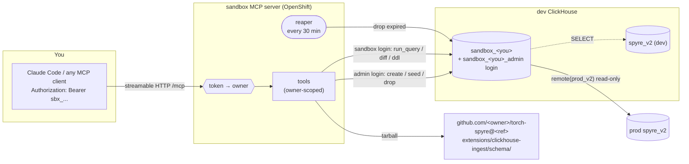
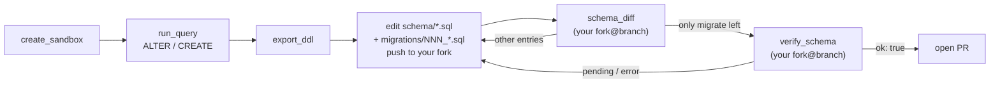

# Sandboxes and the sandbox MCP server

[← Back to index](README.md)

A **sandbox** is your own copy of the `spyre_v2` warehouse on the **dev**
ClickHouse server. It is built from the same `schema/` files that prod is
built from and filled with a real sample of prod data. Inside it you can do
anything: add a column, write a new view, try a migration, or run a heavy
query. None of it can reach prod. The only way a change reaches `spyre_v2`
is a PR to [`schema/`](../schema/README.md).

There are two ways to use sandboxes:

- **The MCP server (most people).** A small HTTP service that holds the dev
  admin login for you. You sign up once with your OpenShift login, point
  Claude Code or any other MCP client at it, and ask for what you need:
  "make me a sandbox with the last 7 days of hf-adapters runs", "add a
  `retries` column to `test_case_runs`", "is my branch ready for a PR?"
- **The `sandbox` CLI (operators).** The same operations run directly with
  the dev admin credentials. It is used to bootstrap the server and to
  manage sandboxes by hand.

- [When to use a sandbox](#when-to-use-a-sandbox)
- [How it works](#how-it-works)
- [Getting started](#getting-started)
- [Tool reference](#tool-reference)
- [Workflows](#workflows)
- [Limits and lifetime](#limits-and-lifetime)
- [Security model](#security-model)
- [The `sandbox` CLI](#the-sandbox-cli)
- [Running the server](#running-the-server)
- [Troubleshooting](#troubleshooting)

---

## When to use a sandbox

| You want to... | Use |
|---|---|
| Prototype a dashboard query against realistic data | `create_sandbox`, then `run_query` |
| Add or change a table, column, view or MV | a sandbox, then `schema_diff` to see what the PR needs |
| Check that a migration works on real rows, not an empty table | `verify_schema` |
| Point DBeaver, `clickhouse-client` or a local `mcp-clickhouse` at your sandbox | `get_login` |
| Read prod without risk | `run_query` with `remote(prod_v2, table='<t>')` |

You do not need a sandbox to *read* dev `spyre_v2`. A sandbox login can read
it too, but a sandbox is the place to *change* things.

## How it works



### Lifecycle of `create_sandbox`

1. **Identify the caller.** The bearer token resolves to an *owner* name such
   as `jane_doe`. Your default sandbox is `sandbox_jane_doe`. With a
   `name_suffix` it is `sandbox_jane_doe__<suffix>`. The double underscore
   never occurs in an owner name, so your suffixed sandbox can never take
   another person's name.
2. **Check limits and ownership.** If the database already exists and its
   owner is someone else, the call is refused. You also cannot go over the
   per-owner sandbox limit.
3. **Fetch the schema.** The server downloads
   `github.com/<schema_repo>/tar.gz/<schema_ref>` and extracts only
   `extensions/clickhouse-ingest/schema/`. Any branch you have pushed to your
   fork works, for example `schema_repo="jane-doe/torch-spyre"`,
   `schema_ref="add-retries-column"`.
4. **Build.** The server creates the database and runs the real applier
   (`apply_schema`) on it: tables, then migrations, then views. This is
   exactly what the Jenkins job would do to a live database. If the applier
   reports drift, the half-built database is dropped.
5. **Grant.** The server creates `sandbox_<name>_admin` with `ALL` on its own
   database, `SELECT` on dev `spyre_v2`, and use of the `prod_v2` named
   collection. Nothing else.
6. **Seed** (see below).
7. **Record metadata.** The owner, creation time, expiry and schema source
   are stored as JSON in the database's `COMMENT`. That comment is the only
   state the server keeps.

### What's in a sandbox

A sandbox is an ordinary ClickHouse database on the dev server. It has the
same objects as `spyre_v2`, because the same `schema/*.sql` files build it.
Dev `spyre_v2` and prod `spyre_v2` share that schema too, but each is a
separate database on its own server. A sandbox's rows are copied from
**prod**.

These are the objects declared by `schema/` on `main`, grouped by how each
one gets its data:

| Kind | Objects | Where its data comes from |
|---|---|---|
| Dimension tables | `test_cases`, `benchmarks`, `capabilities`, `artifacts`, `artifact_refs`, `artifact_tags` | Copied from prod: only the rows that the sampled runs reference |
| Fact tables | `test_case_runs`, `benchmark_runs`, `capability_runs`, `artifact_results`, `hw_failure_diagnostics` | Copied from prod: the rows for the sampled runs |
| Standalone table | `jenkins_agents` | Copied from prod: every row from the last `days` days, not cut to runs |
| MV targets | `run_case_counters`, `oss_ci_benchmark_v3`, `oss_ci_benchmark_metadata` | Not copied. Their materialized views (`*_mv`) fill them as fact rows are inserted |
| Views (21) | `v_artifacts`, `v_tag_*`, `v_tier_trend`, `v_case_*`, `v_run_tier_counters`, `v_tier_report_completeness`, `v_run_coverage`, `v_benchmark_*`, `v_capability_*` | No storage: computed from the tables when queried |
| OpenTelemetry tables | `otel_traces`, `otel_logs`, `otel_metrics_*` (7) | **Empty**: there is no seed rule for them. They are not created at all if the dev server is older than ClickHouse 25.8 |
| Migration ledger | `schema_migrations` | Lists the `migrations/NNN_*.sql` files that have run, as on a live database |
| Seeding scratch | `_seed_runs` (Memory engine) | The sampled run ids. It exists only while a seed runs |

A sandbox built from a branch has whatever that branch declares. Any table,
column or view you add yourself is reported by `schema_diff` as `added` or
`changed`.

### How seeding picks rows

The sample is *connected*, not random. If you sampled each table on its own,
the joins in the views would find nothing. Seeding works like this:

1. **Pick runs.** It takes the most recent `runs_per_component` run ids per
   component within the last `days`, from each run-bearing table
   (`test_case_runs`, `benchmark_runs`, `capability_runs`,
   `artifact_results`, `hw_failure_diagnostics`). You can narrow this by
   `components`, `arches` and artifact `tags`, and add explicit `run_ids`.
2. **Cut every table to those runs.** It copies the fact rows for those runs
   and only the dimension rows they reference: `test_cases`, `benchmarks`,
   `capabilities`, and `artifacts` with their refs and tags.
3. **Dimensions first.** Each dimension is inserted before its facts, so
   materialized views that join at insert time (for example
   `oss_ci_benchmark_v3_mv` joining `benchmarks`) find their rows. MV
   targets fill themselves.
4. **Only shared columns are copied.** If you have already added a column to
   your sandbox table, seeding still works. The new column takes its
   default.
5. **Re-seeding is additive.** Keys the sandbox already holds are skipped, so
   you never get duplicate rows and the MVs count each run once.

A filter on a column that a run source does not have (for example
`components` on `artifact_results`, which has no `component`) leaves that
source out. It does not ignore the filter.

The default seed (14 days, 200 runs per component) is about 1.9M rows and
takes about two minutes.

## Getting started

You need `oc` logged in to the cluster that hosts the server, and an MCP
client. The examples use Claude Code. Replace `<server>` with the server's
public URL, which your team lead or the server's operator can give you.

### 1. Register

Exchange your OpenShift login for a personal sandbox token:

```bash
curl -s -X POST -H "Authorization: Bearer $(oc whoami -t)" https://<server>/register
```

```json
{"owner": "jane_doe", "token": "sbx_jane_doe.Xy3...", "mcp_url": "https://<server>/mcp"}
```

The token does not expire, so keep it like a password. Registering again
gives you the same token. If your team already has a line in the shared
per-user token file used by the prod MCP sidecar, that token works too.

Service-account logins (`system:...`) are refused.

### 2. Add the server to your MCP client

```bash
claude mcp add --transport http clickhouse-sandbox https://<server>/mcp \
  --header "Authorization: Bearer sbx_jane_doe.Xy3..."
```

Any client that speaks streamable-HTTP MCP and can send a bearer header
works the same way.

### 3. Check who you are

Call `whoami` (or ask your assistant "who am I on the sandbox server?"). It
returns your owner name, your sandboxes and the server's limits.

### 4. Create a sandbox

```text
create_sandbox(days=7, runs_per_component=50, components=["hf-adapters"])
```

When it returns, `sandbox_jane_doe` exists and holds data. From here on, use
`run_query`.

## Tool reference

Every tool takes `name_suffix` (default `""`) to pick which of your
sandboxes it acts on: `""` means `sandbox_<you>`, and `"exp1"` means
`sandbox_<you>__exp1`. A suffix is 1–12 characters of `[a-z0-9]`.

Calls that change a sandbox (`create_sandbox`, `seed_sandbox`,
`drop_sandbox`, `extend_sandbox`, `verify_schema`) run one at a time per
owner. A second call waits for the first to finish.

| Tool | What it does | Notable arguments |
|---|---|---|
| `whoami` | Your owner name, sandboxes and the server's limits | — |
| `create_sandbox` | Build from a schema ref and seed from prod | `days`, `runs_per_component`, `components`, `arches`, `tags`, `run_ids`, `schema_repo`, `schema_ref`, `ttl_days`, `replace`, `seed` |
| `seed_sandbox` | Add another prod sample (additive, no duplicates) | same filters as `create_sandbox` |
| `list_sandboxes` | Rows, size, schema source and expiry of each sandbox | — |
| `run_query` | Run any statement as the sandbox's own login | `sql`, `max_rows` (default 200, capped at 1000) |
| `schema_diff` | What your sandbox has that a schema ref does not | `schema_repo`, `schema_ref` |
| `export_ddl` | Every `CREATE` in your sandbox, without the database name | — |
| `verify_schema` | Prove a branch: a fresh apply, plus an upgrade from base with real rows | `schema_repo`, `schema_ref`, `base_repo`, `base_ref` |
| `extend_sandbox` | Move expiry to `ttl_days` from now | `ttl_days` |
| `drop_sandbox` | Drop the sandbox and its login | — |
| `get_login` | Host, port, user and password for an outside client | — |

### `run_query` details

- A statement whose first keyword is `SELECT`, `WITH`, `SHOW`, `DESCRIBE`,
  `DESC`, `EXPLAIN` or `EXISTS` (after any leading comments or opening
  parentheses) returns
  `{"columns": [...], "rows": [...], "truncated": bool}`. Anything else
  (`CREATE`, `ALTER`, `INSERT`, `DROP`, ...) runs as a command and returns
  `{"ok": true}`.
- Read prod with `remote(prod_v2, table='test_case_runs')`. Read dev
  `spyre_v2` directly as `spyre_v2.<table>`.
- Unqualified table names resolve to your sandbox, because it is the login's
  default database.
- ClickHouse errors come back verbatim, cut to 4000 characters.

### `schema_diff` output

Each entry has a `change` field:

| `change` | Meaning | What the PR needs |
|---|---|---|
| `added` | The object is in your sandbox but not in the ref | Its `CREATE` in `schema/` (see `detail`) |
| `changed` | The table or MV differs from the ref's `CREATE` | A migration, plus the updated `CREATE` |
| `view-changed` | The view differs | The updated `CREATE VIEW` |
| `removed` | The ref declares it but your sandbox does not have it | Remove it from `schema/` or recreate it |
| `migrate` | A migration in the ref has not run in your sandbox | Nothing, if this is the only kind left |

When only `migrate` entries are left, your branch covers everything your
sandbox has.

## Workflows

### Explore data or prototype a dashboard query

```text
create_sandbox(days=3, runs_per_component=20)
run_query("SELECT component, count() FROM test_case_runs GROUP BY component")
```

If a sample is too small, `seed_sandbox` with wider filters adds more.
`drop_sandbox` when you are done, or let it expire.

### Turn a schema experiment into a PR



1. **Experiment.** In your sandbox, `ALTER TABLE test_case_runs ADD COLUMN
   retries UInt8 DEFAULT 0`, add views, and so on.
2. **Copy the shapes.** `export_ddl` gives you every `CREATE` as the server
   formats it.
3. **Write the PR content.** Put the final `CREATE` in `schema/NN-*.sql`. A
   live table only changes through a migration, so also add
   `schema/migrations/NNN_*.sql` with the `ALTER`. See the rules in
   [`schema/README.md`](../schema/README.md#applying-it). Push the branch to
   your fork.
4. **Diff against your branch.** Run
   `schema_diff(schema_repo="jane-doe/torch-spyre", schema_ref="my-branch")`.
   Repeat until only `migrate` entries are left.
5. **Prove it.** `verify_schema(schema_repo="jane-doe/torch-spyre",
   schema_ref="my-branch")` builds two temporary sandboxes and drops them
   afterwards:
   - **fresh**: your branch applied to an empty database. `fresh_pending`
     must be empty.
   - **upgrade**: `base_ref` (default `main`) applied, seeded with a small
     real sample (3 days, 5 runs per component), then your branch applied on
     top so your migrations run on real rows. `upgrade_pending` must be
     empty.

   `ok: true` means both paths converge. It takes a few minutes.
6. **Open the PR.** CI's `clickhouse-schema` workflow checks it again on an
   empty server. After merge, the Jenkins job applies it to Spyre-Next and
   then prod.

### Use a desktop SQL client

`get_login` returns `host`, `port` (443), `secure: true`, `database`, `user`
and `password`. The password is derived from the server's secret, so it
stays the same for the sandbox's whole life. Calling `get_login` again gives
you the same values.

## Limits and lifetime

These are the defaults. The operator can change them with environment
variables (see [Running the server](#running-the-server)). `whoami` shows
the values in force.

| Limit | Default | Behaviour when exceeded |
|---|---|---|
| Sandboxes per owner | 3 | `create_sandbox` is refused and lists the sandboxes you have |
| Seed window `days` | 60 max | Clamped |
| `runs_per_component` | 1000 max | Clamped |
| `ttl_days` | 14 default, 30 max | Clamped |
| `run_query` rows returned | 1000 max | `truncated: true` |

A sandbox expires `ttl_days` after it was created or last extended. The
reaper checks every 30 minutes and drops expired sandboxes with their
logins, so data in an expired sandbox is gone. Use `extend_sandbox` to keep
one. Any schema work you care about belongs in a branch anyway.

## Security model

The design has two independent fences. Either one alone would stop you from
touching someone else's sandbox or a live database.

**Fence 1: the server.**

- A token is either an HMAC-signed `sbx_<owner>.<sig>` minted by `/register`,
  or a line in the shared token file. Forged and foreign tokens do not
  resolve. An owner listed in the revoked file is refused whatever token
  they present.
- `/register` asks the OpenShift API who the token belongs to, so you cannot
  register as someone else. Service accounts are refused.
- Every tool looks up the database's `COMMENT` metadata and refuses if the
  owner is not you. The server ignores databases it did not create.
- Schema sources are validated: `<owner>/<repo>` and a ref without `..`. Only
  `codeload.github.com` is fetched, and only the `schema/` subtree is
  extracted (with tarfile's `data` filter).

**Fence 2: ClickHouse grants.**

- `run_query`, `schema_diff` and `export_ddl` run as the sandbox's own login,
  not as admin. That login can write only its own database.
- Prod is reachable only through the `prod_v2` named collection. It holds
  prod's read-only login, and all of its keys are `NOT OVERRIDABLE`. So
  `remote(prod_v2, host='my-host')` cannot redirect the prod password, and
  the password never appears in query text or `system.query_log`.

**What admin still does.** Creating, seeding, granting and dropping run as
the dev admin, because they need rights that a sandbox login must not have.
`verify_schema` also runs as admin, on its own temporary databases.

## The `sandbox` CLI

For operators, with the dev admin credentials in `CLICKHOUSE_*`:

```bash
python -m spyre_clickhouse_ingest.sandbox bootstrap          # once per dev server; needs SANDBOX_SOURCE_PASS
python -m spyre_clickhouse_ingest.sandbox create --name jane --days 7 --runs-per-component 50
python -m spyre_clickhouse_ingest.sandbox seed   --name jane --component hf-adapters
python -m spyre_clickhouse_ingest.sandbox diff   --name jane --schema-dir path/to/branch/schema
python -m spyre_clickhouse_ingest.sandbox list
python -m spyre_clickhouse_ingest.sandbox drop   --name jane
```

- `bootstrap` creates (or, after a password rotation, updates) the `prod_v2`
  named collection. Run it again whenever prod's read-only password changes.
- `create` prints the login password **once**. It is random, not derived.
  `create --replace` rebuilds the sandbox and replaces the login.
- `diff` connects with whatever `CLICKHOUSE_*` holds. The sandbox's own login
  is enough. It exits with 1 if there are differences.
- Sandboxes made by the CLI have no server metadata in their `COMMENT`. The
  MCP server does not list them, does not let anyone act on them, and the
  reaper never drops them. Clean them up by hand.

## Running the server

```bash
pip install "./extensions/clickhouse-ingest[server]"   # adds mcp and uvicorn
python -m spyre_clickhouse_ingest.sandbox_server
```

| Variable | Default | Purpose |
|---|---|---|
| `CLICKHOUSE_HOST` / `_PORT` / `_USER` / `_PASS` / `_SECURE` | — | Dev admin connection |
| `SANDBOX_SECRET` | **required**, at least 32 bytes | Signs minted tokens and derives sandbox passwords |
| `SANDBOX_PUBLIC_URL` | — | External URL; used for `/register`'s `mcp_url` and for allowed `Host` headers |
| `SANDBOX_PUBLIC_CH_HOST` | — | ClickHouse host that `get_login` gives to outside clients |
| `SANDBOX_TOKENS_FILE` | `/etc/sandbox/tokens/tokens.conf` | Shared `<token>=<label>` file, re-read on every request |
| `SANDBOX_REVOKED_FILE` | `/etc/sandbox/tokens/revoked.conf` | One owner (or label) per line to lock out, re-read on every request |
| `SANDBOX_K8S_API` | `https://kubernetes.default.svc` | OpenShift API used by `/register` |
| `SANDBOX_MAX_PER_OWNER` | 3 | Sandboxes per owner |
| `SANDBOX_MAX_DAYS` / `SANDBOX_MAX_RUNS` | 60 / 1000 | Seed caps |
| `SANDBOX_TTL_DAYS` / `SANDBOX_MAX_TTL_DAYS` | 14 / 30 | Default and maximum lifetime |
| `SANDBOX_PORT` | 8080 | Listen port |

Endpoints: `POST /register`, `GET /healthz`, and MCP at `/mcp` (stateless,
JSON responses).

> **Revoking one person:** add their owner name to `SANDBOX_REVOKED_FILE`.
> It takes effect on the next request, and `/register` refuses them too. Their
> sandboxes stay until they expire; drop them with the CLI if needed.
>
> **Rotating `SANDBOX_SECRET`** invalidates every minted token, so users must
> register again. It also changes every derived sandbox password. The server
> notices the first time a sandbox login fails to authenticate and re-sets
> that login's password, so existing sandboxes keep working.

The server keeps no state of its own: ownership and expiry live in each
database's `COMMENT`, and passwords are derived. A restart needs nothing
restored. Run **one replica**: the per-owner serialization of changing
calls is held in process memory.

## Troubleshooting

| Symptom | Cause and fix |
|---|---|
| `401` from `/mcp` | Missing or wrong bearer token. Register again, and check the `--header` you configured. |
| `/register` returns `OpenShift rejected that token` | The `oc` session has expired. Run `oc login`, then try again. |
| `you have no sandbox named sandbox_...` | Wrong `name_suffix`, the sandbox expired, or it was made by the CLI. Call `list_sandboxes`. |
| `limit of N sandboxes reached` | Drop one. A running `verify_schema` briefly holds two temporary sandboxes. |
| `... has no extensions/clickhouse-ingest/schema/*.sql` | The ref does not exist on that repo, or it is not pushed. Check `schema_repo` and `schema_ref`. |
| `SchemaDrift` on create | The schema at that ref does not converge on an empty database. Fix the branch. The partial sandbox was dropped. |
| A column you added is empty after `seed_sandbox` | Expected: prod lacks the column, so it takes its default. |
| `run_query` returned `{"ok": true}` for a query | The statement does not start with a read keyword (for example `INSERT ... SELECT`), so it ran as a command. |
| A sandbox named `sandbox_<you>_<suffix>` (single underscore) is no longer found | It was created before suffixes moved to `__`. Drop it with the CLI and recreate it. |
